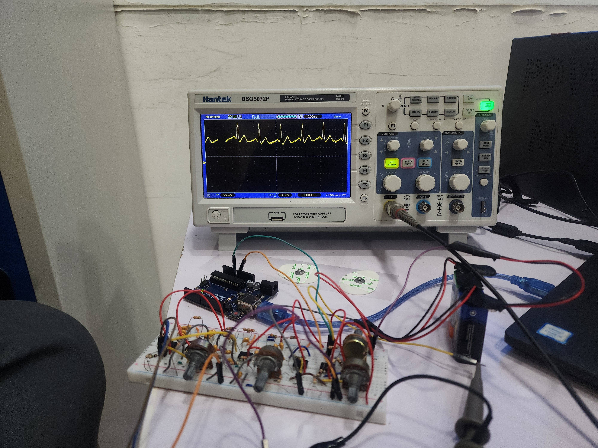
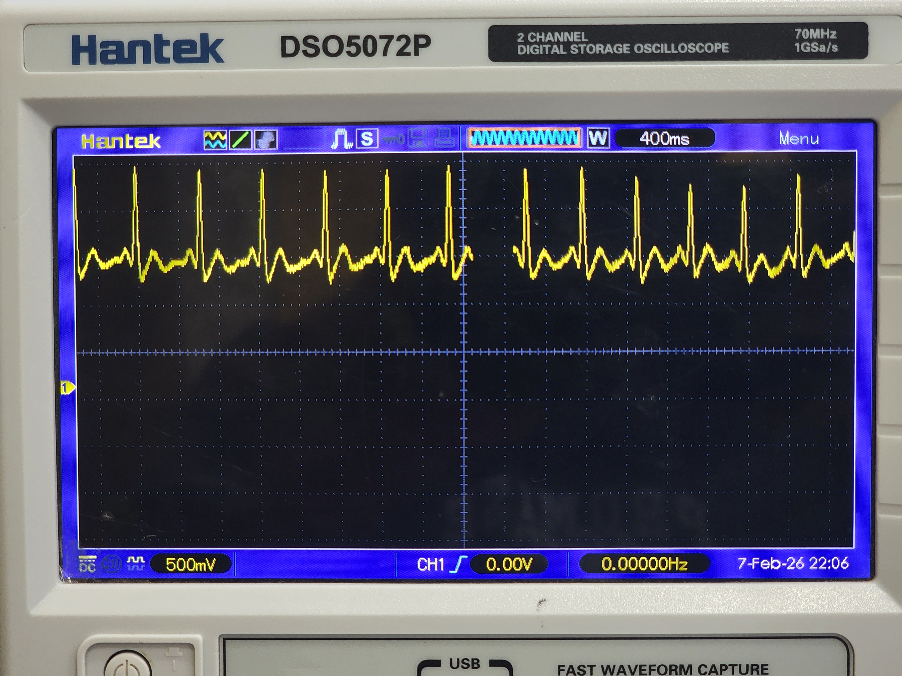

# ECG Signal Acquisition Hardware

**Biomedical Engineering | UST Aden**

Analog front-end (AFE) hardware design for real-time Electrocardiogram (ECG) signal acquisition, developed for integration with embedded microcontroller systems (e.g., ESP32) for arrhythmia classification.

---

## 1. Hardware Architecture

The circuit utilizes standard discrete components to amplify microvolt-level cardiac potentials and attenuate physiological/environmental artifacts.

* **Instrumentation Amplifier:** AD620 configuration for high common-mode rejection ratio (CMRR) to suppress 50 Hz powerline interference.
* **Active Filters:** TL072 / LM741 operational amplifiers configured as a band-pass filter cascade.
    * High-pass stage: Attenuates baseline wander and low-frequency motion artifacts.
    * Low-pass stage: Attenuates high-frequency electromyographic (EMG) noise.

---

## 2. Experimental Results

The hardware prototype was validated using a Hantek digital oscilloscope, confirming clear delineation of the P wave, QRS complex, and T wave morphology.

### 2.1 Hardware Prototype

*Figure 1: Breadboard implementation of the ECG AFE.*

### 2.2 Oscilloscope Validation

*Figure 2: Real-time ECG signal trace demonstrating distinct QRS complexes.*

*Figure 3: Detailed view of the acquired waveform.*

### 2.3 Video Demonstration
* **Hardware Validation:** [Live Oscilloscope ECG Trace (YouTube)](https://youtu.be/GUkwhOJBexI?si=P7ldS8w9NdSfrwVb)

---

## 3. Contact

* **Email:** [a.kh.hatem@gmail.com](mailto:a.kh.hatem@gmail.com)
* **LinkedIn:** [Abdulaziz Hatem](https://linkedin.com/in/abdulazizhatem)
